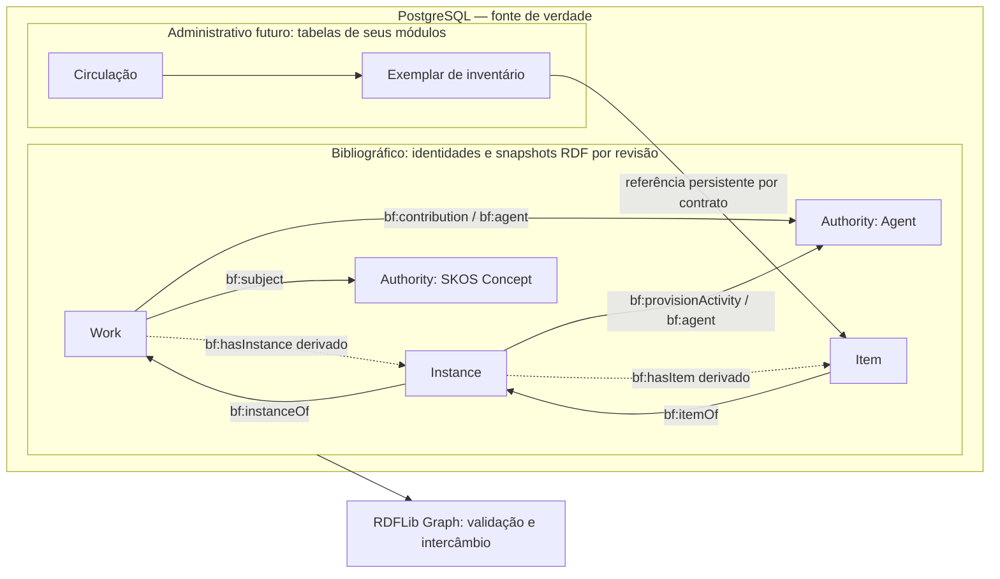

# Etapa 3, Incremento 1 — Diagnóstico e decisões para revisão

Data: 2026-10-09. Momento A concluído por inspeção do repositório. As propostas
abaixo são insumos para o Momento B; não são aprovação institucional nem contrato
implementado. A implementação do Momento C depende da revisão solicitada no pedido.

Registro histórico do Momento A. Após a apresentação, o solicitante autorizou
executar as diretrizes propostas. A implementação e suas evidências estão no
[contrato](catalogographic-contract.md) e no
[relatório](catalogographic-contract-verification.md). As capacidades e ausências
abaixo descrevem o estado anterior à implementação deste incremento.

## Componentes e capacidades encontrados

| Componente | Evidência no repositório | Capacidade e limite |
| --- | --- | --- |
| Monólito modular | `README.md`, `docs/architecture/`, ADRs 0001–0008 | FastAPI com `/health`; catálogo, autoridades, editor e busca ainda ausentes |
| Identidade | `apps/api/src/libris/modules/bibliographic/domain/models.py` | UUID opaco e URI HTTP(S) materializada; criação em `{RESOURCE_BASE_URI}/{uuid}`; sem tipo persistido ou ciclo de vida |
| RDF | `infrastructure/rdf.py` no módulo bibliographic | RDFLib Graph, URIs, literais, idiomas, datatypes e blank nodes; JSON-LD/Turtle com round-trip isomórfico |
| Parsing | Mesmo adaptador | Limites de bytes e profundidade; contextos locais; bloqueio de imports, contextos remotos e datasets |
| Perfil | `resources/monograph-v1.json` | Descrição declarativa de formulário, versão 1 e URI de perfil; não foi encontrado JSON Schema que valide sua estrutura |
| SHACL | `resources/monograph-v1.ttl`, `infrastructure/validation.py` | Shapes locais abertas, sem inferência/imports; relatório estruturado; Warning/Info não bloqueiam |
| Aplicação | `application/service.py` | `create`, `revise`, `read`; serviço controla transações e valida snapshots completos |
| Persistência | `infrastructure/persistence.py` | Duas tabelas experimentais; JSON-LD expandido em JSONB; PostgreSQL é a única fonte gravável |
| Migração | `apps/api/migrations/versions/0001_experimental_semantic.py` | Revisão `0001_semantic`; PK composta, FK diferida para revisão atual e trigger contra UPDATE/DELETE do histórico |
| Concorrência | `RevisionStore.advance` | UPDATE condicional por revisão esperada; conflito gera `StaleRevisionError`; snapshot e avanço no mesmo commit |
| Proveniência | `Provenance`, `SemanticRevision` | Origem, processo, instante UTC e perfil; não há ator autenticado, auditoria de ações completa ou proveniência semântica obrigatória |
| Exemplos | `tests/fixtures/bibliographic/book.ttl`, `docs/examples/book.{ttl,jsonld}` | Uma fixture sintética e suas exportações; não são registros reais independentes |
| Testes | `tests/api/test_bibliographic.py`, `tests/integration/test_semantic_postgres.py` | RDF, SHACL, relações, identidade, parsing; integração PostgreSQL separada para histórico, CAS, rollback e imutabilidade |

Os caminhos `domain/`, `application/`, `infrastructure/` e `resources/` da tabela
pertencem a `apps/api/src/libris/modules/bibliographic/`. Não foram encontrados
ETag, If-Match, resolução HTTP de recursos, serviço de autoridades, outbox,
triplestore, migração definitiva ou JSON Schema do perfil. A rota de saúde não
comprova disponibilidade de PostgreSQL/Elasticsearch.

## Lacunas e incompatibilidades

1. **Identidade RDF não equivale a agregado persistido.** A fixture já tem três
   URIs distintas, mas o serviço salva todo o grafo sob uma raiz e uma revisão.
   Não há partição de propriedade dos nós nem proteção contra snapshots
   sobrepostos e contraditórios. A infraestrutura permite números de revisão
   por recurso, mas não demonstra revisões independentes de entidades ligadas.
2. **As shapes pressupõem fechamento do grafo.** `sh:class` nas relações exige
   tipos locais; targets validam também os recursos relacionados tipados.
   `sh:equals` com caminhos inversos exige as duas direções no mesmo grafo.
   Salvar uma Instance contendo somente sua própria descrição e uma URI de Work
   não atende ao contrato atual. Work com título pode existir sem Instance.
3. **Autoridades não têm ciclo próprio.** A autoria e a editora da fixture usam
   blank nodes; não representam autoridades institucionais compartilháveis.
   `prepare_document` aceita apenas raízes Work/Instance/Item. Assuntos podem
   apontar para URIs, mas não há gestão de identidade local ou equivalência.
4. **O perfil é mínimo.** Há título, idioma, assunto, contribuição, relações,
   edição, publicação, identificadores, extensão, suporte e detentor. Faltam
   regras explícitas para títulos alternativos, notas/proveniência de exemplar,
   autoridades, identificadores externos e estruturas auxiliares completas.
   ISBN aparece na fixture, sem validação específica de valor/checksum.
5. **JSON e SHACL não têm cobertura de compatibilidade suficiente.** O JSON
   marca contribuição/agente/papel como opcionais e agente como repetível;
   as shapes não validam Contribution/Publication/Identifier em profundidade.
   Não há min/max sistemáticos, política de valores ausentes, datatypes ou
   obrigatoriedade por campo. Item sem identificador gera somente advertência.
6. **Título de Instance é obrigatório atualmente.** Torná-lo opcional, como
   sugere o pedido, é mudança de contrato que requer escolha explícita.
7. **Revisão não é edição.** Dois testes adicionam `bf:editionStatement` à Work
   para demonstrar alteração/estabilidade; esse exemplo associa um atributo da
   manifestação à entidade errada. As shapes abertas não detectam essa troca.
8. **Perfil histórico não é completamente reproduzível se v1 for sobrescrito.**
   A revisão guarda apenas o identificador do perfil, e o validador carrega um
   único arquivo atual. É preciso identificar releases imutáveis de JSON/shapes.
9. **Datas e estado são parciais.** A criação e última alteração podem ser
   obtidas do histórico, mas tipo semântico, estado ativo/descontinuado/fundido,
   destino de substituição e política de não reutilização não são persistidos.
10. **Cobertura de casos é restrita.** Não há fixtures separadas para dois
    autores, duas edições, vários Items, autoridade reutilizada, tradução ou
    identificadores externos. Casos inválidos são mutações em testes, sem um
    corpus identificado por cenário.

## Riscos arquiteturais

- Dividir o grafo atual sem definir propriedade pode duplicar autoridades ou
  deixar relações e nós auxiliares sem responsável.
- Manter inversas graváveis em dois snapshots exige coordenação e pode acoplar
  revisões; derivá-las na leitura altera os pressupostos das shapes existentes.
- Copiar rótulos de autoridades para revisões de Works pode tornar metadados
  obsoletos ou transformar uma atualização de autoridade em revisão em cascata.
- Alterar silenciosamente os arquivos v1 muda o significado da validação histórica.
- Importar `Dataset`/named graphs ou outro armazenamento agora substituiria uma
  infraestrutura funcional sem necessidade demonstrada.
- Resolver referências pela rede durante SHACL contraria o adaptador limitado.
- Exigir que a descrição histórica de uma Work incorpore o estado atual de suas
  autoridades mistura história canônica e representação composta para consulta.

## Proposta concreta para revisão

### Identidades e propriedade dos grafos

Cada Work, Instance, Item, Agent e Subject controlado terá UUID, URI armazenada,
tipo, revisão própria, criação, alteração, proveniência e estado. Authority será
um papel institucional, com tipos RDF explícitos; não uma classe BIBFRAME
inventada. Pessoas/organizações e conceitos terão contratos complementares.

Um snapshot conterá a descrição da entidade proprietária e seus nós auxiliares
privados (Title, Contribution, Publication, Identifier, Note etc.). Relações para
outras entidades persistentes conterão URIs; seus atributos não serão copiados
como conteúdo canônico. Blank nodes continuam válidos para estruturas auxiliares
e descrições não controladas, sem simular autoridade institucional.

Canonicalizar `Instance → bf:instanceOf → Work` e `Item → bf:itemOf → Instance`.
Derivar `bf:hasInstance` e `bf:hasItem` em representações compostas com contexto
local. Atualizar a descrição de Instance não revisa Work; alterar o vínculo
revisa a entidade que o possui. Referências locais precisam de verificação
transacional por contratos de serviço; SHACL sozinho não garante existência no
banco. Referências externas não serão dereferenciadas para validação.

Separar validação do snapshot proprietário de validação do grafo composto. O
contexto de validação deve distinguir referências de entidades efetivamente
descritas, evitando aplicar targets completos a meros nós de referência.
Os helpers atuais que adicionam inversas continuam úteis em grafos compostos.

Alternativa: materializar inversas em ambos os snapshots. Facilita leitura de
um snapshot isolado, mas exige coordenação entre agregados e tratamento explícito
das revisões afetadas. Recomenda-se derivação, com especificação de histórico:
snapshot histórico devolve as afirmações daquela revisão; composição histórica
exige corte temporal/revisões escolhidas e não promete reconstrução global atual.

### Persistência e concorrência

Manter PostgreSQL com JSON-LD expandido em JSONB como fonte de verdade para RDF,
identidade e histórico. Graph é representação em memória, não um segundo banco.
Reutilizar o serviço transacional, o adaptador e o CAS; não criar serviço paralelo.
Snapshots permanecem imutáveis e isomórficos após serialização. Dados operacionais
pertencem a seus módulos e referenciam identidade persistente de Item, sem avançar
sua revisão bibliográfica.

O Incremento 1 especificará e testará independência onde houver infraestrutura;
qualquer extensão física deve continuar experimental e ter migração aditiva
revisada. Não converter snapshots agregados existentes automaticamente: preservar
originais, explicitar formato/perfil legado e planejar uma transformação rastreável
antes de adotar o novo formato em escrita. Não editar a migração já existente.

Não introduzir outbox neste incremento, pois não há projeção consumidora. Ao
implementar indexação, evento e revisão serão gravados no mesmo commit PostgreSQL;
consumo idempotente por entidade/revisão, tentativas e reconstrução a partir da
fonte canônica. Não há transação distribuída. Hoje, falha em validação ou gravação
reverte tanto avanço quanto snapshot; não há falha parcial entre RDF Store e SQL.

Definir um validador de escrita opaco que inclua UUID e revisão. No Incremento 2,
If-Match obrigatório para atualização: ausência 428, versão obsoleta 412; rejeitar
validador fraco como precondição de escrita. ETag de cache deve refletir também
formato e dependências de representações compostas: UUID/revisão sozinhos não são
um ETag forte correto para JSON-LD e Turtle ou para rótulos/inversas derivados.
Definir representação de edição estável com seu ETag forte e separar esse fluxo
das exportações compostas; não publicar um ETag forte comum a bytes distintos.

Named graphs físicos ficam adiados. A chave `(resource_id, number)` identifica
snapshot histórico sem mudar a URI do recurso. Um Dataset de exportação seria
alternativa futura com novo contrato de parsing; não é requisito para histórico
em PostgreSQL e aumenta superfície de validação e armazenamento.

### Política de URIs e resolução futura

Preservar a convenção existente `{RESOURCE_BASE_URI}/{uuid}`, inclusive para
autoridades, sem renomear identidades para `/id/works/...`. O tipo pertence aos
metadados e não precisa estar no caminho. URLs da interface são distintas.
UUID excluído/descontinuado nunca volta a ser alocado; URI já armazenada prevalece
quando a configuração muda. O domínio público requer decisão institucional.

Proposta de resolução para o Incremento 2: URI de identidade ativa responde 303
para a representação escolhida por Accept (JSON-LD, Turtle ou interface HTML).
Representação responde 200 com tipo correto e `Vary: Accept` quando negociada;
sem Accept, escolher JSON-LD; formato não suportado, 406; desconhecido, 404.
Descontinuado sem sucessor responde 410, com informação de descontinuação;
fundido responde 308 para a identidade sobrevivente, mantendo tombstone e histórico.
Substituição sem equivalência não redireciona como fusão: registra relação
explícita e motivo. Escolher entre 303 e resposta RDF direta 200 é decisão pendente;
303 distingue recurso bibliográfico de documento e exige URLs de representação.
Nenhum endpoint de resolução será implementado neste incremento.

### Perfil e autoridades

Preservar v1 experimental como release legada. Consolidar o candidato institucional
com versão de release e identificador imutáveis, mantendo a família monograph-v1;
guardar na revisão o release exato validado. Definir JSON Schema local para o
descritor e testar sua correspondência com shapes, sem confundir schema de
formulário com validação semântica dos registros.

Cada campo terá entidade, caminho RDF, estrutura de valor, min/max, repetibilidade,
idioma/datatype, severidade, política de ausência e vocabulário. Ausência de campo
opcional omite a tripla; não cria literal vazio ou autoridade fictícia. Work
requer título principal; Instance requer uma Work e Item requer uma Instance.
Recomenda-se título de Instance opcional e identificador institucional de Item
obrigatório no candidato institucional; ambas as mudanças precisam de revisão.
ISBN é opcional e pertence à Instance. Documentar política para ISBN transcrito
inválido em vez de descartar informação automaticamente.

Contribution controlada: um agente por nó, um ou mais papéis explícitos por URI.
Agente pode ser reutilizado por várias Works e atividades de publicação de
Instances. Agent/Person/Organization terão formas autorizadas e variantes,
identificadores externos e proveniência; Subject controlado utilizará SKOS com
política de rótulo autorizado por idioma. `owl:sameAs` exige equivalência
comprovada; identificação externa e links de referência não a implicam.

Tradução terá idioma e contribuição de tradutor na Work traduzida, relacionada
à Work de origem; sua Instance conterá publicação/edição/ISBN. Validar essa
escolha com catalogadores, pois relação entre expressão/tradução e Work é uma
decisão catalográfica que não se reduz à edição física.

## Diagrama proposto, não implementado

## Decisões a confirmar e ADRs previstos

Seguir a numeração existente, sem sobrescrever ADRs 0001–0008. Registrar as novas
decisões como **Proposto**, com contexto, alternativas, consequências e estado.

| ADR previsto | Decisão para revisão |
| --- | --- |
| 0009 — Identidade bibliográfica | Entidades independentes, propriedade dos nós auxiliares e formato legado preservado |
| 0010 — Persistência bibliográfica e operacional | JSONB canônico e fronteira com inventário/circulação; extensões físicas somente experimentais nesta fase |
| 0011 — Versionamento e concorrência | Revisões independentes; distinção entre snapshot e composição; precondições de escrita e ETags de representação |
| 0012 — URIs institucionais | Manter `/resources/{uuid}`; 303/200, tombstones, fusões, domínio e política de HTTP |
| 0013 — Agentes e assuntos | Autoridades reutilizáveis, contribuição/papéis, equivalência comprovada e tratamento de traduções |
| 0014 — Evolução de perfis | Release legado preservado; candidato imutável; título de Instance, identificação de Item e cardinalidades |
| 0015 — Consistência transacional e RDF | Commit único PostgreSQL; inversas derivadas; outbox somente quando existir consumidor |

A revisão pode confirmar o conjunto recomendado ou indicar exceções, especialmente
inversas, URIs/resolução e evolução do perfil. O domínio público, as regras de
equivalência e a aprovação catalográfica não serão presumidos aprovados.

## Plano de implementação após revisão

1. Registrar os sete ADRs e o contrato institucional com a matriz completa de
   campos e política de compatibilidade, mantendo explícito seu estado de revisão.
2. Consolidar JSON, seu schema local e shapes com modos de validação adequados
   ao snapshot e à composição; aproveitar adaptadores e relatórios existentes.
3. Criar corpus sintético identificado pelos dez cenários do pedido e casos
   inválidos de cardinalidade, tipo e relações; preservar a fixture legada.
4. Testar isomorfismo JSON-LD/Turtle, URIs, autoridades compartilhadas, propriedade,
   independência de revisões e retenção de vínculos. Testes de persistência exigem
   PostgreSQL descartável; testes sem banco não provarão atomicidade SQL.
5. Executar verificações e registrar resultados, arquivos e limites observados.

Pendências para o Incremento 2: APIs de catalogação e resolução, DTOs e negociação
HTTP, implementação de precondições, autorização/ator de auditoria, verificação
transacional de referências e estratégia explícita para adoção do novo formato
de snapshots. Editor, busca, reconciliação externa e circulação continuam fora
deste incremento.

## Verificação do diagnóstico

| Verificação executada | Resultado nesta sessão |
| --- | --- |
| `bash scripts/check.sh` | Interrompido na entrada: `uv` via snap falhou em `snap-confine`; partes executadas diretamente abaixo |
| `.venv/bin/python -m pytest` | 33 passaram; 9 avisos de depreciação conhecidos; execução fora do sandbox após bloqueio de streams na tentativa inicial |
| `.venv/bin/python -m ruff check . ../../tests` | Passou |
| `.venv/bin/python -m mypy src` | Passou, 18 arquivos |
| CLI bibliográfico sobre a fixture legada | Conforme; 49 triplas; nenhuma issue |
| `alembic heads` | `0001_semantic (head)` |
| `alembic upgrade head --sql` | Passou em modo offline; não aplicou migrações a banco |
| `docker compose --env-file .env.example config --quiet` | Passou |
| `npm run build` / `npm run typecheck` | Ambos passaram com ferramentas locais fora do sandbox |

A tentativa inicial de build
no sandbox falhou ao ler a saída de `TypeScript --showConfig`; a repetição usa as
ferramentas locais existentes fora do sandbox. Não foram instaladas dependências.
Integração PostgreSQL não foi executada neste diagnóstico; não há nova comprovação
de round-trip JSONB ou concorrência real nesta sessão. As evidências históricas da
Etapa 2 em `verification.md` não substituem execução atual.

Único arquivo criado: este diagnóstico. Nenhum arquivo de código, perfil, shape,
lock ou migração foi modificado. Os sete ADRs estão planejados para revisão, ainda
não registrados como decisões adotadas. A conclusão do Momento A não implica a
conclusão técnica de todo o Incremento 1.
