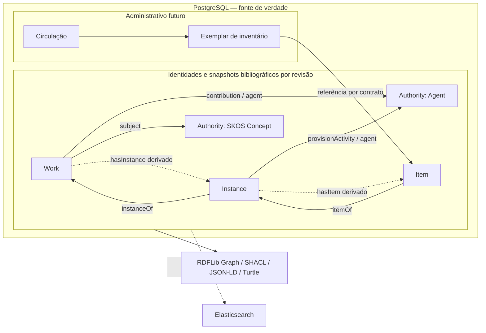

# Contrato catalográfico — Etapa 3, Incremento 1

Release candidata institucional: **monograph-v1, release 1.1**,
`urn:libris:profile:monograph:v1:1`. Perfil complementar de autoridades:
`urn:libris:profile:authority:v1`, release 1.0. Implementação técnica autorizada
após o diagnóstico; homologação institucional e avaliação com catalogadores
continuam pendentes. Estes artefatos não definem esquema bibliográfico definitivo.

## Artefatos e compatibilidade

- `apps/api/src/libris/modules/bibliographic/resources/monograph-v1.json` e `.ttl`
  são a release experimental legada; permanecem intactos, com seu identificador.
- `monograph-v1.1.json` e `.ttl` contêm a candidata institucional. O JSON descreve
  formulários; SHACL é autoridade para conformidade do RDF. O modo composto usa
  também `monograph-v1.1-composed.ttl` para conferir inversas.
- `authority-v1.json` e `.ttl` descrevem autoridades reutilizáveis, sem implementar
  um novo módulo/serviço de autoridades ou reconciliação externa.
- `catalog-profile.schema.json` é o JSON Schema local gerado por
  `domain/profiles.py`, com estrutura e tipos para descritores de formulário.
  Pydantic também verifica coerência de cardinalidades, repetibilidade e ausência;
  tais invariantes cruzadas não são todas expressas pelo JSON Schema.
- `tests/fixtures/bibliographic/institutional/manifest.json` identifica dez casos
  válidos e casos deliberadamente inválidos. Todos são sintéticos; nomes, ISBNs
  e identificadores externos não afirmam registros/autoridades reais.

Não substituir arquivos de uma release publicada. Alterações posteriores de
regras, inclusive correções incompatíveis, recebem novos artefatos e ID de release.
Revisões guardam exatamente o perfil usado. Nenhum dado existente é convertido.
A assinatura existente de `create` mantém o perfil legado como default; o chamador
deve indicar explicitamente a release institucional ou a de autoridades. `revise`
reutiliza o perfil persistido e não oferece migração implícita.

Para adotar o novo contrato em um agregado antigo: planejar transformação explícita,
preservar histórico original, mapear identidades e afirmar propriedade dos nós,
validar as entidades resultantes e registrar origem/revisão da transformação.
Não executar divisão automática ou gravar cópias sobrepostas de uma autoridade.

## Entidades, propriedade e relacionamentos

Work representa criação intelectual, títulos, idioma, assuntos, contribuições e
relações entre obras. Pode existir sem manifestações. Instance representa edição,
publicação, ISBN, extensão e suporte. Item representa exemplar bibliográfico,
identificação local, instituição detentora, notas e proveniência próprias.

Cada entidade persistente tem UUID e URI próprios. Pessoas/organizações controladas
usam `bf:Agent`, `bf:Person` ou `bf:Organization`; conceitos usam `skos:Concept`.
Authority é responsabilidade institucional, não uma classe RDF criada artificialmente.
Metadados da autoridade são revisados em seu snapshot; obras guardam referências.

O snapshot tem uma raiz e sua descrição, com nós auxiliares privados. Estes podem
ser blank nodes locais ao grafo ou IRIs sob `{uri-da-raiz}#fragmento`. Essa convenção
é para auxiliares: a URI de entidade não admite fragmentos. Entidades persistentes
relacionadas não têm sua descrição incluída no snapshot proprietário. Nós órfãos,
segunda raiz, tipo incompatível e inversas gravadas são rejeitados. O contrato é
aberto a outras ontologias e propriedades; não reduz RDF a campos JSON escalares.

As relações canônicas são `Instance bf:instanceOf Work` e `Item bf:itemOf Instance`.
`bf:hasInstance` e `bf:hasItem` são derivadas na composição, sem revisão em cascata
do pai. Mudar o vínculo revisa a entidade que o possui. No perfil de monografia,
Instance tem exatamente uma Work e Item exatamente uma Instance; isso é escolha
institucional deste perfil, não cardinalidade universal de BIBFRAME.

`Work bf:contribution Contribution` mantém o nó de contribuição, um agente por URI
e um ou mais papéis por URI. `bf:subject` referencia conceito controlado ou URI
externa. `bf:provisionActivity` mantém atividade de publicação, agentes, lugar e
data na Instance. Os nós de Title/Identifier/Publication/Note não têm revisões
independentes: integram a revisão de sua entidade proprietária.

Blank nodes de grafos diferentes são renomeados ao compor; coincidência de rótulos
de serialização não significa identidade. Composição rejeita duas revisões da mesma
raiz e preserva termos RDF. A função não modifica os snapshots fornecidos.

## Validação e referências

`validate_monograph` preserva a validação legada. `validate_profile` carrega apenas
releases locais conhecidas; não aceita paths, shapes ou imports fornecidos nos dados.
Inferência, regras avançadas, JavaScript e downloads seguem desabilitados.

Validação de snapshot confere descrição proprietária e estruturas auxiliares, sem
exigir que a autoridade/Work/Instance referenciada esteja descrita no mesmo grafo.
Quando uma referência tem tipo no grafo composto, as shapes conferem sua classe.
O modo `composed=True` também exige igualdade entre relações diretas e inversas.
Um grafo com referências externas pode ser conforme sem existir uma descrição local
dessas referências; conformidade SHACL não prova existência no PostgreSQL.

Integridade de referências locais, tratamento de recursos descontinuados e troca
de vínculos por serviços transacionais ficam para o Incremento 2. Não adicionar
tipos fictícios às referências para satisfazer shapes, nem consultar URIs na rede.
Alvos SHACL não substituem a exigência de raiz: um grafo vazio pode ter conformidade
vazia, mas não pode ser persistido como entidade.

## Regras catalográficas

Work requer ao menos um título não variante. Títulos alternativos usam
`bf:VariantTitle` via `bf:title`; `bf:mainTitle` conserva idioma e exige literal
textual não vazio, no máximo um por idioma em cada nó. Título de Instance é opcional;
ausência não grava cópia do título de Work. Interfaces futuras podem apresentá-lo
por composição, deixando clara sua origem.

Item exige ao menos um `bf:Local` com `rdf:value` textual não vazio. Outros
identificadores podem coexistir. Barcode ou número de inventário são atributos;
nunca substituem o UUID ou a URI. `bf:heldBy` é referência opcional à instituição.
Notas estruturadas usam `bf:Note`/`rdfs:label`; histórico de custódia pode usar
`bf:custodialHistory` e fontes semânticas `prov:wasDerivedFrom`.

ISBN é opcional, pertence à Instance e usa `bf:Isbn`/`rdf:value`. Esta release
verifica estrutura, cardinalidade e valor textual não vazio; não afirma checksum
correto nem registro em agência ISBN. ISBN transcrito inválido deve ser mantido
com indicação de situação/nota em política posterior, sem corrigir ou descartar
automaticamente a informação. Edição bibliográfica é `bf:editionStatement` na
Instance, distinta do número de revisão de metadados.

Datas de publicação admitem `xsd:gYear`, `xsd:date` ou `xsd:string` transcrito,
preservando incerteza; inteiro genérico não representa data no perfil. Extensão,
classificação e publicação são estruturas RDF, não strings indiferenciadas.
Campos textuais conservam idioma quando aplicável. Valores opcionais ausentes
omitem triplas; valores obrigatórios ausentes produzem violação. Não preencher
strings vazias, idioma presumido ou autoridades fictícias.

Formas autorizadas de agentes usam `rdfs:label`, uma por idioma; variantes usam
`skos:altLabel`. Conceitos exigem `skos:prefLabel`, um por idioma e disjunto de
`skos:altLabel`, e `skos:inScheme`. Relações de conceitos usam `skos:broader` e
`skos:related`; relações de autoridades podem usar `dcterms:relation`.

URIs VIAF/ORCID/ISNI/Wikidata podem aparecer em `rdfs:seeAlso`; identificadores
externos estruturados usam valor e fonte. Link externo não implica equivalência.
`owl:sameAs` exige equivalência comprovada, proveniência e revisão humana; não é
gerado pelo serviço. Termos de vocabulários indicados no perfil orientam o formulário
e a catalogação, mas a pertença efetiva a um vocabulário não é consultada na rede.

Tradução é Work com idioma, contribuição de tradutor (`relators/trl`) e
`bf:translationOf` para a Work original. As manifestações das duas Works têm suas
edições/publicações/ISBNs. A regra é candidata à homologação catalográfica; não
confundir mudança de idioma com simples revisão administrativa de uma Instance.

## Persistência, metadados e ciclo de vida

| Informação do contrato | Fonte de verdade ou estado atual |
| --- | --- |
| UUID e URI | `experimental_semantic_resources.id/uri` |
| Revisão atual | `current_revision`, protegida por FK diferida e CAS |
| Tipo semântico | `rdf:type` da raiz no snapshot canônico; serviço preserva entre revisões institucionais |
| Criação e última alteração | `created_at` da revisão 1 e da revisão atual, em UTC |
| Histórico e conteúdo RDF | `experimental_semantic_revisions`, JSON-LD expandido em JSONB, append-only |
| Proveniência técnica e release | `source`, `process`, `profile` por revisão |
| Proveniência semântica | RDF da entidade, quando fornecida |
| Estado ativo/descontinuado/fundido/substituído | Política especificada abaixo; armazenamento/operações futuros, ainda não implementados |
| Ator humano e autorização | Incremento 2; não há usuário fictício ou auditoria humana simulada |
| Inventário, reservas, empréstimos, multas | Módulos administrativos futuros, referenciando identidade persistente de Item |

O mesmo PostgreSQL contém identidade, controle transacional e RDF. RDFLib não é
um segundo store gravável. Avanço CAS e snapshot acontecem no mesmo commit;
falha em validação, serialização ou inserção causa rollback. Rejeição obsoleta
não sobrescreve alterações. Histórico não sofre UPDATE/DELETE por DML normal.
Não foram criadas novas tabelas, migrações ou um esquema bibliográfico definitivo.

Alterar Authority, Instance ou Item não altera automaticamente Work. Circulação
não modifica o grafo bibliográfico como estado primário nem revisa Item. Um
exemplar administrativo tem identidade própria e referencia Item/Instance por
contratos; módulos não acessam tabelas de outro domínio.

Não há outbox ou publicação de eventos agora. Ao surgir uma projeção, gravar evento
com event_id, entidade e revisão no commit PostgreSQL; consumir idempotentemente,
registrar tentativas e reconstruir a projeção a partir da fonte canônica.
Elasticsearch continuará reconstruível; não há transações distribuídas ou escrita
dupla. Recuperação atual utiliza atomicidade PostgreSQL e histórico; backups e
políticas operacionais não foram implementados neste incremento.

## Concorrência e representações históricas

`Revision.concurrency_token` expressa `{uuid}:r{revisão}` e está vinculado à entidade.
`require_revision_token` confere igualdade exata e rejeita token de outra entidade,
obsoleto ou curinga. É um token de domínio; não é um ETag HTTP de todos os formatos.
O serviço continua exigindo `expected_revision` e usando CAS PostgreSQL.

Contrato para a API futura: ausência de If-Match em escrita responde 428;
precondição obsoleta responde 412. A representação estável de edição terá ETag
forte próprio; sua comparação usará identidade/revisão e versão do serializador.
Não aceitar validador fraco ou `*` como substituto da revisão esperada. Se o ETag
encapsular formato/hash, o adaptador HTTP deverá verificá-los antes de traduzir
a precondição para a revisão, sem comparar cegamente com o token de domínio.

JSON-LD, Turtle e interface/composição possuem bytes/dependências diferentes:
seus ETags de cache também são diferentes. Mudança em autoridade ou novos filhos
altera composição/inversas sem necessariamente alterar revisão de Work. ETag
de composição deve refletir essas dependências. Não prometer estabilidade de
blank-node labels ou ordem de serialização; a fidelidade RDF usa isomorfismo.

`read(id, number)` retorna apenas o snapshot proprietário daquela revisão.
Composição histórica requer escolha explícita das revisões relacionadas ou um
corte temporal documentado; não combina silenciosamente autoridade atual com
afirmações históricas como se fosse uma revisão global. Named graphs físicos
ficam adiados: a chave recurso+revisão já identifica o snapshot, sem mudar a URI
da entidade ou acrescentar Dataset ao adaptador.

## Política institucional de URIs e HTTP futuro

A forma é `{RESOURCE_BASE_URI}/{uuid}`, atualmente `/resources/{uuid}`. O UUID é
opaco e aleatório; tipo, título, idioma, ISBN, barcode e localização não participam
da identidade. URI é materializada na criação e reutilizada nas revisões. Trocar
a base de ambiente não reescreve identidades existentes. Não reutilizar UUIDs
descontinuados/excluídos; tombstones deverão reservar a identidade indefinidamente.
Domínio público e políticas de publicação ainda precisam de escolha institucional.

| Situação/solicitação | Comportamento contratado para o Incremento 2 |
| --- | --- |
| Identidade ativa, Accept JSON-LD | 303 para documento JSON-LD; documento 200, `application/ld+json` |
| Identidade ativa, Accept Turtle | 303 para documento Turtle; documento 200, `text/turtle` |
| Identidade ativa, Accept HTML | 303 para URL da interface; HTML 200 |
| Sem Accept ou `*/*` | Preferir JSON-LD; aceitar negociação por qualidade/especificidade, ignorando q=0 |
| Accept sem representação disponível | 406; não retornar HTML silenciosamente |
| Resposta negociada | `Vary: Accept`; informar URI canônica e tipo correto na representação |
| UUID desconhecido | 404, sem inventar tombstone |
| Descontinuado sem sucessor equivalente | 410, informação de estado e acesso ao histórico conforme permissão |
| Fusão comprovada | 308 da identidade anterior para sobrevivente; manter tombstone, motivo e histórico; impedir ciclos |
| Substituição sem equivalência | Não tratar como fusão; manter estado/histórico e relação explícita com sucessor; identidade antiga responde 410 se descontinuada |
| Revisão inexistente | 404; URI da entidade continua a mesma |

As URLs concretas de documentos/interface e o suporte completo a negociação serão
definidos na API; este incremento não cria resolver HTTP. Não redirecionar para
uma URI externa por simples `seeAlso` ou identificador. Mudanças de domínio exigem
preservação/redirecionamento da base antiga e plano explícito; não derivar novas
URIs para registros já existentes a cada leitura.

## Diagrama de entidades e fronteiras



## Uso interno e inspeção

```python
from libris.modules.bibliographic.infrastructure.validation import INSTITUTIONAL_PROFILE_ID

# Dentro de função async, graph contém somente a entidade e seus auxiliares.
# await service.create(identity, graph, provenance, profile=INSTITUTIONAL_PROFILE_ID)
# await service.revise(identity.internal_id, expected_revision=1,
#                      graph=updated_graph, provenance=provenance)
```

Da pasta `apps/api`, inspeção sem gravação:

```bash
uv run python -m libris.modules.bibliographic \
  ../../tests/fixtures/bibliographic/institutional/two-editions.ttl \
  --profile urn:libris:profile:monograph:v1:1
```

A fixture contém relações diretas canônicas. Para `--composed`, fornecer um grafo
composto com inversas; o CLI valida, não corrige divergências. Serviços continuam
internos, sem endpoints de catálogo ou novos formulários Next.js.

## Referências e decisões

Modelagem baseada na [ontologia oficial BIBFRAME da Library of Congress](https://github.com/lcnetdev/bibframe-ontology/blob/master/bibframe.rdf)
e nas regras de rótulos de [SKOS Reference](https://www.w3.org/TR/skos-reference/).
As cardinalidades e o tratamento institucional de traduções são escolhas deste
contrato, sujeitas à homologação, e não afirmações universais da ontologia.

Ver ADRs 0009–0015 em `docs/decisions/`, o
[diagnóstico](catalogographic-contract-diagnosis.md) e o
[relatório de alterações e verificação](catalogographic-contract-verification.md).


## Matriz de campos por proprietário

Esta matriz acompanha os JSONs versionados. `1..*` é obrigatório e repetível;
`0..*` é opcional e repetível; `1..1` é obrigatório e não repetível. Ausência
obrigatória viola SHACL; ausência opcional omite a tripla. Tipo literal sempre
exige valor não vazio. `IRI` é referência; `BlankNodeOrIRI` é estrutura auxiliar
privada quando há descrição. Regras adicionais constam na coluna de validação.
Os vocabulários informados são sugestões controladas para formulários; não são
consultados remotamente. O campo marcado derivado não integra escrita do snapshot.

### Monografia institucional — candidato 1.1

Proprietário: **Obra** (`bf:Work`).

| Nome funcional | Propriedade RDF | Valor / idioma | Cardinalidade | Destino / vocabulário | Validação |
| --- | --- | --- | --- | --- | --- |
| Títulos principal e alternativos | `bf:title` | BlankNodeOrIRI | 1..* | bf:Title, bf:VariantTitle | Ao menos um título não variante; um mainTitle por idioma em cada nó. |
| Idioma | `bf:language` | IRI | 0..* |  http://id.loc.gov/vocabulary/languages/ | Referência RDF explícita; sem resolução remota. |
| Conteúdo | `bf:content` | IRI | 0..* |  http://id.loc.gov/vocabulary/contentTypes/ | Referência RDF explícita; sem resolução remota. |
| Contribuições | `bf:contribution` | BlankNodeOrIRI | 0..* | bf:Contribution | Referência RDF explícita; sem resolução remota. |
| Assuntos | `bf:subject` | IRI | 0..* | skos:Concept | Referência RDF explícita; sem resolução remota. |
| Classificação | `bf:classification` | BlankNodeOrIRI | 0..* | bf:Classification | Referência RDF explícita; sem resolução remota. |
| Obras relacionadas | `bf:relatedTo` | IRI | 0..* | bf:Work | Referência RDF explícita; sem resolução remota. |
| Tradução de | `bf:translationOf` | IRI | 0..* | bf:Work | Referência RDF explícita; sem resolução remota. |
| Manifestações | `bf:hasInstance` | IRI | 0..* | bf:Instance | Derivado. Derivada de instanceOf; não gravar no snapshot proprietário. |
| Notas | `bf:note` | BlankNodeOrIRI | 0..* | bf:Note | Referência RDF explícita; sem resolução remota. |

Proprietário: **Manifestação** (`bf:Instance`).

| Nome funcional | Propriedade RDF | Valor / idioma | Cardinalidade | Destino / vocabulário | Validação |
| --- | --- | --- | --- | --- | --- |
| Título | `bf:title` | BlankNodeOrIRI | 0..* | bf:Title, bf:VariantTitle | Referência RDF explícita; sem resolução remota. |
| Indicação de edição | `bf:editionStatement` | Literal: xsd:string, rdf:langString; idioma preservado | 0..* | — | Literal não vazio; preservar idioma/datatype. |
| Publicação | `bf:provisionActivity` | BlankNodeOrIRI | 0..* | bf:Publication | Referência RDF explícita; sem resolução remota. |
| Identificadores | `bf:identifiedBy` | BlankNodeOrIRI | 0..* | bf:Identifier, bf:Local, bf:Isbn | Referência RDF explícita; sem resolução remota. |
| Extensão | `bf:extent` | BlankNodeOrIRI | 0..* | bf:Extent | Referência RDF explícita; sem resolução remota. |
| Suporte | `bf:carrier` | IRI | 0..* |  http://id.loc.gov/vocabulary/carriers/ | Referência RDF explícita; sem resolução remota. |
| Obra | `bf:instanceOf` | IRI | 1..1 | bf:Work | Referência RDF explícita; sem resolução remota. |
| Exemplares | `bf:hasItem` | IRI | 0..* | bf:Item | Derivado. Derivada de itemOf; não gravar no snapshot proprietário. |
| Notas | `bf:note` | BlankNodeOrIRI | 0..* | bf:Note | Referência RDF explícita; sem resolução remota. |

Proprietário: **Exemplar bibliográfico** (`bf:Item`).

| Nome funcional | Propriedade RDF | Valor / idioma | Cardinalidade | Destino / vocabulário | Validação |
| --- | --- | --- | --- | --- | --- |
| Manifestação | `bf:itemOf` | IRI | 1..1 | bf:Instance | Referência RDF explícita; sem resolução remota. |
| Identificador institucional | `bf:identifiedBy` | BlankNodeOrIRI | 1..* | bf:Identifier, bf:Local | Ao menos um bf:Local com rdf:value não vazio; barcode/inventário são atributos. |
| Instituição detentora | `bf:heldBy` | IRI | 0..* | bf:Organization | Referência RDF explícita; sem resolução remota. |
| Notas | `bf:note` | BlankNodeOrIRI | 0..* | bf:Note | Referência RDF explícita; sem resolução remota. |
| Histórico de custódia | `bf:custodialHistory` | Literal: xsd:string, rdf:langString; idioma preservado | 0..* | — | Literal não vazio; preservar idioma/datatype. |
| Informação bibliográfica de localização | `bf:itemLocation` | BlankNodeOrIRI | 0..* | — | Referência RDF explícita; sem resolução remota. |
| Proveniência semântica | `prov:wasDerivedFrom` | IRI | 0..* | — | Referência RDF explícita; sem resolução remota. |

Proprietário: **Título** (`bf:Title`).

| Nome funcional | Propriedade RDF | Valor / idioma | Cardinalidade | Destino / vocabulário | Validação |
| --- | --- | --- | --- | --- | --- |
| Título principal | `bf:mainTitle` | Literal: xsd:string, rdf:langString; idioma preservado | 1..* | — | Literal não vazio; preservar idioma/datatype. |
| Subtítulo | `bf:subtitle` | Literal: xsd:string, rdf:langString; idioma preservado | 0..* | — | Literal não vazio; preservar idioma/datatype. |

Proprietário: **Contribuição** (`bf:Contribution`).

| Nome funcional | Propriedade RDF | Valor / idioma | Cardinalidade | Destino / vocabulário | Validação |
| --- | --- | --- | --- | --- | --- |
| Agente | `bf:agent` | IRI | 1..1 | bf:Agent, bf:Person, bf:Organization | Referência RDF explícita; sem resolução remota. |
| Papel | `bf:role` | IRI | 1..* |  http://id.loc.gov/vocabulary/relators/ | Referência RDF explícita; sem resolução remota. |

Proprietário: **Publicação** (`bf:Publication`).

| Nome funcional | Propriedade RDF | Valor / idioma | Cardinalidade | Destino / vocabulário | Validação |
| --- | --- | --- | --- | --- | --- |
| Publicador | `bf:agent` | IRI | 0..* | bf:Agent, bf:Person, bf:Organization | Referência RDF explícita; sem resolução remota. |
| Local de publicação | `bf:place` | IRI | 0..* | — | Referência RDF explícita; sem resolução remota. |
| Data de publicação | `bf:date` | Literal: xsd:string, xsd:gYear, xsd:date | 0..* | — | Texto transcrito ou data/gYear bem tipados; conservar incerteza como texto. |

Proprietário: **Identificador** (`bf:Identifier`).

| Nome funcional | Propriedade RDF | Valor / idioma | Cardinalidade | Destino / vocabulário | Validação |
| --- | --- | --- | --- | --- | --- |
| Valor | `rdf:value` | Literal: xsd:string | 1..1 | — | Literal não vazio; preservar idioma/datatype. |
| Fonte | `bf:source` | IRI | 0..* | — | Referência RDF explícita; sem resolução remota. |

Proprietário: **Extensão** (`bf:Extent`).

| Nome funcional | Propriedade RDF | Valor / idioma | Cardinalidade | Destino / vocabulário | Validação |
| --- | --- | --- | --- | --- | --- |
| Descrição | `rdfs:label` | Literal: xsd:string, rdf:langString; idioma preservado | 1..* | — | Literal não vazio; preservar idioma/datatype. |

Proprietário: **Nota** (`bf:Note`).

| Nome funcional | Propriedade RDF | Valor / idioma | Cardinalidade | Destino / vocabulário | Validação |
| --- | --- | --- | --- | --- | --- |
| Texto | `rdfs:label` | Literal: xsd:string, rdf:langString; idioma preservado | 1..* | — | Literal não vazio; preservar idioma/datatype. |
| Tipo da nota | `bf:noteType` | Literal: xsd:string | 0..* | — | Literal não vazio; preservar idioma/datatype. |

Proprietário: **Classificação** (`bf:Classification`).

| Nome funcional | Propriedade RDF | Valor / idioma | Cardinalidade | Destino / vocabulário | Validação |
| --- | --- | --- | --- | --- | --- |
| Código de classificação | `bf:classificationPortion` | Literal: xsd:string | 1..* | — | Literal não vazio; preservar idioma/datatype. |
| Esquema de classificação | `bf:source` | IRI | 0..* | — | Referência RDF explícita; sem resolução remota. |

Proprietário: **Título alternativo** (`bf:VariantTitle`).

| Nome funcional | Propriedade RDF | Valor / idioma | Cardinalidade | Destino / vocabulário | Validação |
| --- | --- | --- | --- | --- | --- |
| Título principal | `bf:mainTitle` | Literal: xsd:string, rdf:langString; idioma preservado | 1..* | — | Literal não vazio; preservar idioma/datatype. |
| Subtítulo | `bf:subtitle` | Literal: xsd:string, rdf:langString; idioma preservado | 0..* | — | Literal não vazio; preservar idioma/datatype. |

Proprietário: **Identificador local** (`bf:Local`).

| Nome funcional | Propriedade RDF | Valor / idioma | Cardinalidade | Destino / vocabulário | Validação |
| --- | --- | --- | --- | --- | --- |
| Valor | `rdf:value` | Literal: xsd:string | 1..1 | — | Literal não vazio; preservar idioma/datatype. |
| Fonte | `bf:source` | IRI | 0..* | — | Referência RDF explícita; sem resolução remota. |

Proprietário: **ISBN** (`bf:Isbn`).

| Nome funcional | Propriedade RDF | Valor / idioma | Cardinalidade | Destino / vocabulário | Validação |
| --- | --- | --- | --- | --- | --- |
| Valor | `rdf:value` | Literal: xsd:string | 1..1 | — | Literal não vazio; preservar idioma/datatype. |
| Fonte | `bf:source` | IRI | 0..* | — | Referência RDF explícita; sem resolução remota. |

### Autoridades básicas — candidato 1

Proprietário: **Agente** (`bf:Agent`).

| Nome funcional | Propriedade RDF | Valor / idioma | Cardinalidade | Destino / vocabulário | Validação |
| --- | --- | --- | --- | --- | --- |
| Forma autorizada | `rdfs:label` | Literal: xsd:string, rdf:langString; idioma preservado | 1..* | — | Uma forma autorizada por idioma; preservar forma transcrita. |
| Formas variantes | `skos:altLabel` | Literal: xsd:string, rdf:langString; idioma preservado | 0..* | — | Literal não vazio; preservar idioma/datatype. |
| Identificadores | `bf:identifiedBy` | BlankNodeOrIRI | 0..* | bf:Identifier, bf:Local, bf:Isbn | Referência RDF explícita; sem resolução remota. |
| Referências externas | `rdfs:seeAlso` | IRI | 0..* | — | Referência RDF explícita; sem resolução remota. |
| Proveniência | `prov:wasDerivedFrom` | IRI | 0..* | — | Referência RDF explícita; sem resolução remota. |
| Autoridade relacionada | `dcterms:relation` | IRI | 0..* | — | Referência RDF explícita; sem resolução remota. |

Proprietário: **Pessoa** (`bf:Person`).

| Nome funcional | Propriedade RDF | Valor / idioma | Cardinalidade | Destino / vocabulário | Validação |
| --- | --- | --- | --- | --- | --- |
| Forma autorizada | `rdfs:label` | Literal: xsd:string, rdf:langString; idioma preservado | 1..* | — | Uma forma autorizada por idioma; preservar forma transcrita. |
| Formas variantes | `skos:altLabel` | Literal: xsd:string, rdf:langString; idioma preservado | 0..* | — | Literal não vazio; preservar idioma/datatype. |
| Identificadores | `bf:identifiedBy` | BlankNodeOrIRI | 0..* | bf:Identifier, bf:Local, bf:Isbn | Referência RDF explícita; sem resolução remota. |
| Referências externas | `rdfs:seeAlso` | IRI | 0..* | — | Referência RDF explícita; sem resolução remota. |
| Proveniência | `prov:wasDerivedFrom` | IRI | 0..* | — | Referência RDF explícita; sem resolução remota. |
| Autoridade relacionada | `dcterms:relation` | IRI | 0..* | — | Referência RDF explícita; sem resolução remota. |

Proprietário: **Entidade coletiva** (`bf:Organization`).

| Nome funcional | Propriedade RDF | Valor / idioma | Cardinalidade | Destino / vocabulário | Validação |
| --- | --- | --- | --- | --- | --- |
| Forma autorizada | `rdfs:label` | Literal: xsd:string, rdf:langString; idioma preservado | 1..* | — | Uma forma autorizada por idioma; preservar forma transcrita. |
| Formas variantes | `skos:altLabel` | Literal: xsd:string, rdf:langString; idioma preservado | 0..* | — | Literal não vazio; preservar idioma/datatype. |
| Identificadores | `bf:identifiedBy` | BlankNodeOrIRI | 0..* | bf:Identifier, bf:Local, bf:Isbn | Referência RDF explícita; sem resolução remota. |
| Referências externas | `rdfs:seeAlso` | IRI | 0..* | — | Referência RDF explícita; sem resolução remota. |
| Proveniência | `prov:wasDerivedFrom` | IRI | 0..* | — | Referência RDF explícita; sem resolução remota. |
| Autoridade relacionada | `dcterms:relation` | IRI | 0..* | — | Referência RDF explícita; sem resolução remota. |

Proprietário: **Conceito controlado** (`skos:Concept`).

| Nome funcional | Propriedade RDF | Valor / idioma | Cardinalidade | Destino / vocabulário | Validação |
| --- | --- | --- | --- | --- | --- |
| Termo autorizado | `skos:prefLabel` | Literal: xsd:string, rdf:langString; idioma preservado | 1..* | — | Um prefLabel por idioma; disjunto de altLabel. |
| Termos variantes | `skos:altLabel` | Literal: xsd:string, rdf:langString; idioma preservado | 0..* | — | Literal não vazio; preservar idioma/datatype. |
| Vocabulário | `skos:inScheme` | IRI | 1..* | — | Referência RDF explícita; sem resolução remota. |
| Conceito mais amplo | `skos:broader` | IRI | 0..* | — | Referência RDF explícita; sem resolução remota. |
| Conceito relacionado | `skos:related` | IRI | 0..* | — | Referência RDF explícita; sem resolução remota. |
| Referências externas | `rdfs:seeAlso` | IRI | 0..* | — | Referência RDF explícita; sem resolução remota. |
| Proveniência | `prov:wasDerivedFrom` | IRI | 0..* | — | Referência RDF explícita; sem resolução remota. |


## Matriz de campos por proprietário

Esta matriz acompanha os JSONs versionados. `1..*` é obrigatório e repetível;
`0..*` é opcional e repetível; `1..1` é obrigatório e não repetível. Ausência
obrigatória viola SHACL; ausência opcional omite a tripla. Tipo literal sempre
exige valor não vazio. `IRI` é referência; `BlankNodeOrIRI` é estrutura auxiliar
privada quando há descrição. Regras adicionais constam na coluna de validação.
Os vocabulários informados são sugestões controladas para formulários; não são
consultados remotamente. O campo marcado derivado não integra escrita do snapshot.

### Monografia institucional — candidato 1.1

Proprietário: **Obra** (`bf:Work`).

| Nome funcional | Propriedade RDF | Valor / idioma | Cardinalidade | Destino / vocabulário | Validação |
| --- | --- | --- | --- | --- | --- |
| Títulos principal e alternativos | `bf:title` | BlankNodeOrIRI | 1..* | bf:Title, bf:VariantTitle | Ao menos um título não variante; um mainTitle por idioma em cada nó. |
| Idioma | `bf:language` | IRI | 0..* |  http://id.loc.gov/vocabulary/languages/ | Referência RDF explícita; sem resolução remota. |
| Conteúdo | `bf:content` | IRI | 0..* |  http://id.loc.gov/vocabulary/contentTypes/ | Referência RDF explícita; sem resolução remota. |
| Contribuições | `bf:contribution` | BlankNodeOrIRI | 0..* | bf:Contribution | Referência RDF explícita; sem resolução remota. |
| Assuntos | `bf:subject` | IRI | 0..* | skos:Concept | Referência RDF explícita; sem resolução remota. |
| Classificação | `bf:classification` | BlankNodeOrIRI | 0..* | bf:Classification | Referência RDF explícita; sem resolução remota. |
| Obras relacionadas | `bf:relatedTo` | IRI | 0..* | bf:Work | Referência RDF explícita; sem resolução remota. |
| Tradução de | `bf:translationOf` | IRI | 0..* | bf:Work | Referência RDF explícita; sem resolução remota. |
| Manifestações | `bf:hasInstance` | IRI | 0..* | bf:Instance | Derivado. Derivada de instanceOf; não gravar no snapshot proprietário. |
| Notas | `bf:note` | BlankNodeOrIRI | 0..* | bf:Note | Referência RDF explícita; sem resolução remota. |

Proprietário: **Manifestação** (`bf:Instance`).

| Nome funcional | Propriedade RDF | Valor / idioma | Cardinalidade | Destino / vocabulário | Validação |
| --- | --- | --- | --- | --- | --- |
| Título | `bf:title` | BlankNodeOrIRI | 0..* | bf:Title, bf:VariantTitle | Referência RDF explícita; sem resolução remota. |
| Indicação de edição | `bf:editionStatement` | Literal: xsd:string, rdf:langString; idioma preservado | 0..* | — | Literal não vazio; preservar idioma/datatype. |
| Publicação | `bf:provisionActivity` | BlankNodeOrIRI | 0..* | bf:Publication | Referência RDF explícita; sem resolução remota. |
| Identificadores | `bf:identifiedBy` | BlankNodeOrIRI | 0..* | bf:Identifier, bf:Local, bf:Isbn | Referência RDF explícita; sem resolução remota. |
| Extensão | `bf:extent` | BlankNodeOrIRI | 0..* | bf:Extent | Referência RDF explícita; sem resolução remota. |
| Suporte | `bf:carrier` | IRI | 0..* |  http://id.loc.gov/vocabulary/carriers/ | Referência RDF explícita; sem resolução remota. |
| Obra | `bf:instanceOf` | IRI | 1..1 | bf:Work | Referência RDF explícita; sem resolução remota. |
| Exemplares | `bf:hasItem` | IRI | 0..* | bf:Item | Derivado. Derivada de itemOf; não gravar no snapshot proprietário. |
| Notas | `bf:note` | BlankNodeOrIRI | 0..* | bf:Note | Referência RDF explícita; sem resolução remota. |

Proprietário: **Exemplar bibliográfico** (`bf:Item`).

| Nome funcional | Propriedade RDF | Valor / idioma | Cardinalidade | Destino / vocabulário | Validação |
| --- | --- | --- | --- | --- | --- |
| Manifestação | `bf:itemOf` | IRI | 1..1 | bf:Instance | Referência RDF explícita; sem resolução remota. |
| Identificador institucional | `bf:identifiedBy` | BlankNodeOrIRI | 1..* | bf:Identifier, bf:Local | Ao menos um bf:Local com rdf:value não vazio; barcode/inventário são atributos. |
| Instituição detentora | `bf:heldBy` | IRI | 0..* | bf:Organization | Referência RDF explícita; sem resolução remota. |
| Notas | `bf:note` | BlankNodeOrIRI | 0..* | bf:Note | Referência RDF explícita; sem resolução remota. |
| Histórico de custódia | `bf:custodialHistory` | Literal: xsd:string, rdf:langString; idioma preservado | 0..* | — | Literal não vazio; preservar idioma/datatype. |
| Marca de estante bibliográfica | `bf:shelfMark` | BlankNodeOrIRI | 0..* | bf:ShelfMark | Referência RDF explícita; sem resolução remota. |
| Proveniência semântica | `prov:wasDerivedFrom` | IRI | 0..* | — | Referência RDF explícita; sem resolução remota. |

Proprietário: **Título** (`bf:Title`).

| Nome funcional | Propriedade RDF | Valor / idioma | Cardinalidade | Destino / vocabulário | Validação |
| --- | --- | --- | --- | --- | --- |
| Título principal | `bf:mainTitle` | Literal: xsd:string, rdf:langString; idioma preservado | 1..* | — | Literal não vazio; preservar idioma/datatype. |
| Subtítulo | `bf:subtitle` | Literal: xsd:string, rdf:langString; idioma preservado | 0..* | — | Literal não vazio; preservar idioma/datatype. |

Proprietário: **Contribuição** (`bf:Contribution`).

| Nome funcional | Propriedade RDF | Valor / idioma | Cardinalidade | Destino / vocabulário | Validação |
| --- | --- | --- | --- | --- | --- |
| Agente | `bf:agent` | IRI | 1..1 | bf:Agent, bf:Person, bf:Organization | Referência RDF explícita; sem resolução remota. |
| Papel | `bf:role` | IRI | 1..* |  http://id.loc.gov/vocabulary/relators/ | Referência RDF explícita; sem resolução remota. |

Proprietário: **Publicação** (`bf:Publication`).

| Nome funcional | Propriedade RDF | Valor / idioma | Cardinalidade | Destino / vocabulário | Validação |
| --- | --- | --- | --- | --- | --- |
| Publicador | `bf:agent` | IRI | 0..* | bf:Agent, bf:Person, bf:Organization | Referência RDF explícita; sem resolução remota. |
| Local de publicação | `bf:place` | IRI | 0..* | — | Referência RDF explícita; sem resolução remota. |
| Data de publicação | `bf:date` | Literal: xsd:string, xsd:gYear, xsd:date | 0..* | — | Texto transcrito ou data/gYear bem tipados; conservar incerteza como texto. |

Proprietário: **Identificador** (`bf:Identifier`).

| Nome funcional | Propriedade RDF | Valor / idioma | Cardinalidade | Destino / vocabulário | Validação |
| --- | --- | --- | --- | --- | --- |
| Valor | `rdf:value` | Literal: xsd:string | 1..1 | — | Literal não vazio; preservar idioma/datatype. |
| Fonte | `bf:source` | IRI | 0..* | — | Referência RDF explícita; sem resolução remota. |

Proprietário: **Extensão** (`bf:Extent`).

| Nome funcional | Propriedade RDF | Valor / idioma | Cardinalidade | Destino / vocabulário | Validação |
| --- | --- | --- | --- | --- | --- |
| Descrição | `rdfs:label` | Literal: xsd:string, rdf:langString; idioma preservado | 1..* | — | Literal não vazio; preservar idioma/datatype. |

Proprietário: **Nota** (`bf:Note`).

| Nome funcional | Propriedade RDF | Valor / idioma | Cardinalidade | Destino / vocabulário | Validação |
| --- | --- | --- | --- | --- | --- |
| Texto | `rdfs:label` | Literal: xsd:string, rdf:langString; idioma preservado | 1..* | — | Literal não vazio; preservar idioma/datatype. |
| Tipo da nota | `bf:noteType` | Literal: xsd:string | 0..* | — | Literal não vazio; preservar idioma/datatype. |

Proprietário: **Classificação** (`bf:Classification`).

| Nome funcional | Propriedade RDF | Valor / idioma | Cardinalidade | Destino / vocabulário | Validação |
| --- | --- | --- | --- | --- | --- |
| Código de classificação | `bf:classificationPortion` | Literal: xsd:string | 1..* | — | Literal não vazio; preservar idioma/datatype. |
| Esquema de classificação | `bf:source` | IRI | 0..* | — | Referência RDF explícita; sem resolução remota. |

Proprietário: **Título alternativo** (`bf:VariantTitle`).

| Nome funcional | Propriedade RDF | Valor / idioma | Cardinalidade | Destino / vocabulário | Validação |
| --- | --- | --- | --- | --- | --- |
| Título principal | `bf:mainTitle` | Literal: xsd:string, rdf:langString; idioma preservado | 1..* | — | Literal não vazio; preservar idioma/datatype. |
| Subtítulo | `bf:subtitle` | Literal: xsd:string, rdf:langString; idioma preservado | 0..* | — | Literal não vazio; preservar idioma/datatype. |

Proprietário: **Identificador local** (`bf:Local`).

| Nome funcional | Propriedade RDF | Valor / idioma | Cardinalidade | Destino / vocabulário | Validação |
| --- | --- | --- | --- | --- | --- |
| Valor | `rdf:value` | Literal: xsd:string | 1..1 | — | Literal não vazio; preservar idioma/datatype. |
| Fonte | `bf:source` | IRI | 0..* | — | Referência RDF explícita; sem resolução remota. |

Proprietário: **ISBN** (`bf:Isbn`).

| Nome funcional | Propriedade RDF | Valor / idioma | Cardinalidade | Destino / vocabulário | Validação |
| --- | --- | --- | --- | --- | --- |
| Valor | `rdf:value` | Literal: xsd:string | 1..1 | — | Literal não vazio; preservar idioma/datatype. |
| Fonte | `bf:source` | IRI | 0..* | — | Referência RDF explícita; sem resolução remota. |

Proprietário: **Marca de estante** (`bf:ShelfMark`).

| Nome funcional | Propriedade RDF | Valor / idioma | Cardinalidade | Destino / vocabulário | Validação |
| --- | --- | --- | --- | --- | --- |
| Valor | `rdf:value` | Literal: xsd:string | 1..1 | — | Literal não vazio; preservar idioma/datatype. |
| Fonte | `bf:source` | IRI | 0..* | — | Referência RDF explícita; sem resolução remota. |

### Autoridades básicas — candidato 1

Proprietário: **Agente** (`bf:Agent`).

| Nome funcional | Propriedade RDF | Valor / idioma | Cardinalidade | Destino / vocabulário | Validação |
| --- | --- | --- | --- | --- | --- |
| Forma autorizada | `rdfs:label` | Literal: xsd:string, rdf:langString; idioma preservado | 1..* | — | Uma forma autorizada por idioma; preservar forma transcrita. |
| Formas variantes | `skos:altLabel` | Literal: xsd:string, rdf:langString; idioma preservado | 0..* | — | Literal não vazio; preservar idioma/datatype. |
| Identificadores | `bf:identifiedBy` | BlankNodeOrIRI | 0..* | bf:Identifier, bf:Local, bf:Isbn | Referência RDF explícita; sem resolução remota. |
| Referências externas | `rdfs:seeAlso` | IRI | 0..* | — | Referência RDF explícita; sem resolução remota. |
| Proveniência | `prov:wasDerivedFrom` | IRI | 0..* | — | Referência RDF explícita; sem resolução remota. |
| Autoridade relacionada | `dcterms:relation` | IRI | 0..* | — | Referência RDF explícita; sem resolução remota. |

Proprietário: **Pessoa** (`bf:Person`).

| Nome funcional | Propriedade RDF | Valor / idioma | Cardinalidade | Destino / vocabulário | Validação |
| --- | --- | --- | --- | --- | --- |
| Forma autorizada | `rdfs:label` | Literal: xsd:string, rdf:langString; idioma preservado | 1..* | — | Uma forma autorizada por idioma; preservar forma transcrita. |
| Formas variantes | `skos:altLabel` | Literal: xsd:string, rdf:langString; idioma preservado | 0..* | — | Literal não vazio; preservar idioma/datatype. |
| Identificadores | `bf:identifiedBy` | BlankNodeOrIRI | 0..* | bf:Identifier, bf:Local, bf:Isbn | Referência RDF explícita; sem resolução remota. |
| Referências externas | `rdfs:seeAlso` | IRI | 0..* | — | Referência RDF explícita; sem resolução remota. |
| Proveniência | `prov:wasDerivedFrom` | IRI | 0..* | — | Referência RDF explícita; sem resolução remota. |
| Autoridade relacionada | `dcterms:relation` | IRI | 0..* | — | Referência RDF explícita; sem resolução remota. |

Proprietário: **Entidade coletiva** (`bf:Organization`).

| Nome funcional | Propriedade RDF | Valor / idioma | Cardinalidade | Destino / vocabulário | Validação |
| --- | --- | --- | --- | --- | --- |
| Forma autorizada | `rdfs:label` | Literal: xsd:string, rdf:langString; idioma preservado | 1..* | — | Uma forma autorizada por idioma; preservar forma transcrita. |
| Formas variantes | `skos:altLabel` | Literal: xsd:string, rdf:langString; idioma preservado | 0..* | — | Literal não vazio; preservar idioma/datatype. |
| Identificadores | `bf:identifiedBy` | BlankNodeOrIRI | 0..* | bf:Identifier, bf:Local, bf:Isbn | Referência RDF explícita; sem resolução remota. |
| Referências externas | `rdfs:seeAlso` | IRI | 0..* | — | Referência RDF explícita; sem resolução remota. |
| Proveniência | `prov:wasDerivedFrom` | IRI | 0..* | — | Referência RDF explícita; sem resolução remota. |
| Autoridade relacionada | `dcterms:relation` | IRI | 0..* | — | Referência RDF explícita; sem resolução remota. |

Proprietário: **Conceito controlado** (`skos:Concept`).

| Nome funcional | Propriedade RDF | Valor / idioma | Cardinalidade | Destino / vocabulário | Validação |
| --- | --- | --- | --- | --- | --- |
| Termo autorizado | `skos:prefLabel` | Literal: xsd:string, rdf:langString; idioma preservado | 1..* | — | Um prefLabel por idioma; disjunto de altLabel. |
| Termos variantes | `skos:altLabel` | Literal: xsd:string, rdf:langString; idioma preservado | 0..* | — | Literal não vazio; preservar idioma/datatype. |
| Vocabulário | `skos:inScheme` | IRI | 1..* | — | Referência RDF explícita; sem resolução remota. |
| Conceito mais amplo | `skos:broader` | IRI | 0..* | — | Referência RDF explícita; sem resolução remota. |
| Conceito relacionado | `skos:related` | IRI | 0..* | — | Referência RDF explícita; sem resolução remota. |
| Referências externas | `rdfs:seeAlso` | IRI | 0..* | — | Referência RDF explícita; sem resolução remota. |
| Proveniência | `prov:wasDerivedFrom` | IRI | 0..* | — | Referência RDF explícita; sem resolução remota. |

