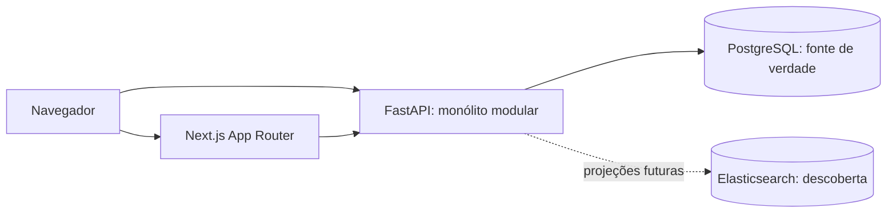

# Arquitetura inicial do Libris

## Escopo e estado

O Libris será um ILS de código aberto, modular e orientado a dados conectados.
Há uma API de saúde, uma página institucional bilíngue, infraestrutura local e
um núcleo semântico experimental com RDF/SHACL e snapshots PostgreSQL.
A [fundação semântica](semantic-foundation.md) documenta a Etapa 2. Não há catalogação, login,
consulta bibliográfica ou operações de circulação. A licença de distribuição do
projeto ainda precisa ser escolhida pelos mantenedores antes de publicação.

## Visão de execução

As conexões do diagrama, exceto navegador/página e chamada de saúde, indicam a
arquitetura pretendida: não existe ainda consulta de domínio ou indexação. Backend
e frontend são processos separados, não microsserviços de negócio. Os bancos são
serviços de infraestrutura. Um único backend controla transações e módulos.

## Organização do código

- `apps/api/src/libris`: fábrica FastAPI, configuração, rotas e infraestrutura.
- `apps/api/src/libris/modules`: núcleo bibliográfico experimental; demais domínios futuros.
- `apps/api/migrations`: ambiente Alembic assíncrono e migração semântica experimental.
- `apps/web/src/app`: App Router e páginas `/pt`, `/en`; `/` redireciona para `/pt`.
- `apps/web/src/i18n`: dicionários tipados; internacionalização explícita por URL.
- `packages/shared`: reservado para contratos OpenAPI e vocabulários compartilhados.
- `tests/api`: testes da API, executados pela configuração de `apps/api`.
- `infrastructure/docker`: receitas de imagem; Compose permanece na raiz.

Quando um domínio for implementado, separar `api` (rotas e DTOs), `application`
(casos de uso e fronteiras transacionais), `domain` (invariantes) e `infrastructure`
(repositórios e adaptadores) conforme houver necessidade. Não criar um framework
interno, repositório genérico ou camada vazia para cada nome listado. Chamadas
entre módulos usam serviços explícitos; nenhum módulo modifica tabelas de outro.

## Dados, integração e processamento

PostgreSQL é a fonte transacional de verdade. SQLAlchemy 2 usa engine/sessões
assíncronas e asyncpg; Alembic controla alterações de esquema revisadas. As sessões
não fazem commit implicitamente: os casos de uso deverão delimitar a transação.
Não executar `create_all` ou migrações no startup de cada réplica.

Elasticsearch mantém projeções desnormalizadas e reconstruíveis, nunca o registro
bibliográfico canônico. A descoberta poderá ter consistência eventual. Ao nascer
a primeira escrita que exige indexação, introduzir outbox transacional no mesmo
commit PostgreSQL, entrega idempotente, versões de eventos e repetição com registro
de falhas. Nesta etapa não há fila, worker, broker nem tabela outbox. Eventos não
podem ser publicados antes de confirmar a transação.

Integrações MARC, protocolos bibliotecários e sistemas externos ficarão em
adaptadores. Contratos HTTP serão descritos por OpenAPI e evoluídos com compatibilidade;
rotas de negócio futuras terão prefixo `/api/v1`. `/health` fica independente.

## Operação, segurança e qualidade

`/health` é liveness: confirma apenas que a aplicação responde. Não representa
readiness de PostgreSQL ou Elasticsearch. Um endpoint de readiness com timeouts
será necessário quando as APIs realmente dependerem deles. O Compose verifica
PostgreSQL e Elasticsearch separadamente e aguarda sua saúde antes de iniciar a API.

Configuração por ambiente validada por Pydantic Settings. Não há autenticação
simulada. Autenticação, autorização, proteção de dados pessoais, auditoria e
políticas institucionais exigirão decisões antes dos módulos de usuários/circulação.
CORS tem origens explícitas. Imagens de aplicação executam como usuário sem privilégios.
O Compose é exclusivamente local: portas no loopback, Elasticsearch sem segurança,
senha descartável em `.env.example`. Produção exigirá TLS, credenciais, backups,
restrição de rede e observabilidade definidos para o ambiente real.

Página simples usa elementos nativos acessíveis e a primitiva Separator do Radix UI.
Radix estabelece a base de componentes acessíveis; shadcn/ui será adotado para
controles complexos quando necessários, evitando instalar componentes sem uso.
Testes de inicialização são isolados dos serviços externos; testes futuros de
persistência deverão usar PostgreSQL real. Locks preservam dependências; tags de
imagens com major ainda podem receber patches, e deverão ganhar digests no pipeline
de entrega. Não há CI/CD, métricas, backup automático ou promessa de escala validada.

## Referências e versões

Python de referência 3.13, compatibilidade declarada 3.13–3.14; Node.js 24 LTS;
Next.js 16, React 19, Tailwind 4, PostgreSQL 17, Elasticsearch 9.5.5.
As versões exatas das dependências Python e JavaScript estão em `uv.lock` e `package-lock.json`.
Foram consultados [instalação do Next.js](https://nextjs.org/docs/app/getting-started/installation),
[FastAPI/PyPI](https://pypi.org/project/fastapi/),
[imagens oficiais Elastic](https://www.docker.elastic.co/r/elasticsearch/elasticsearch) e
[distribuições oficiais Node.js](https://nodejs.org/dist/latest-v24.x/SHASUMS256.txt).
